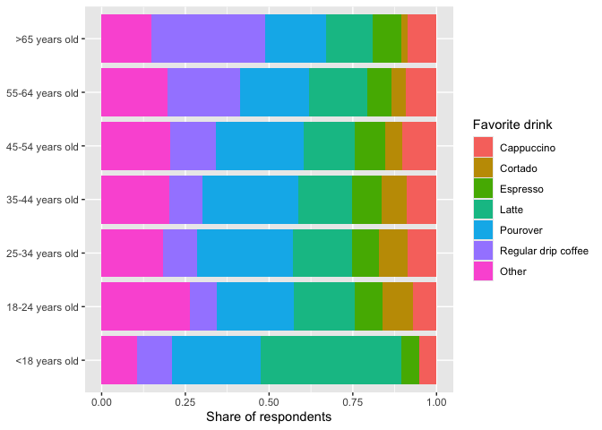
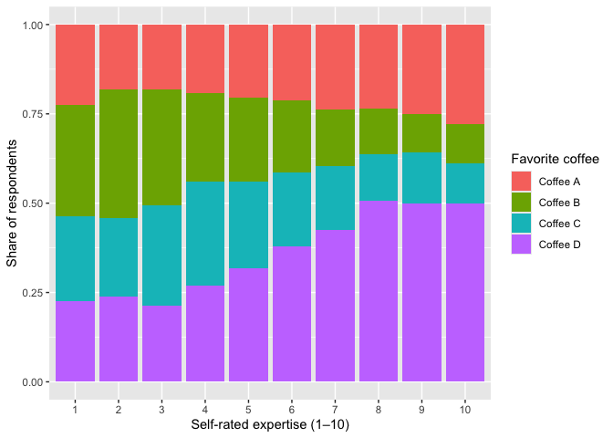
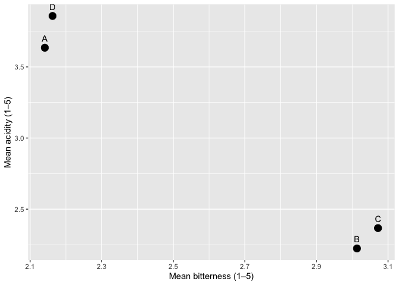
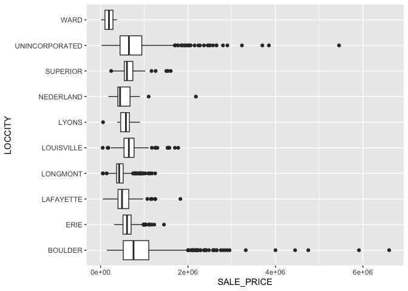
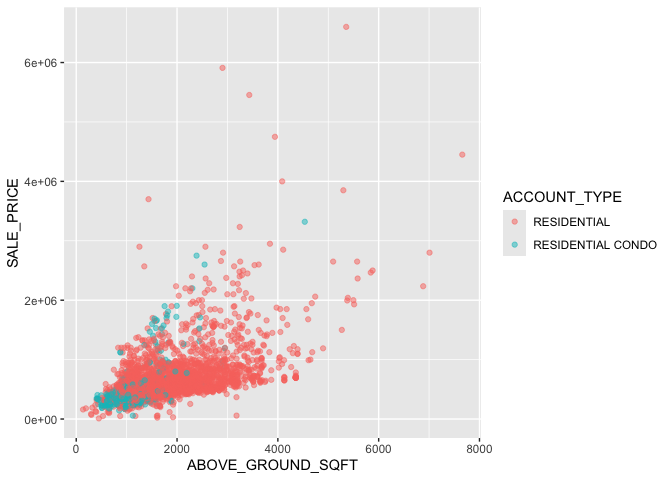
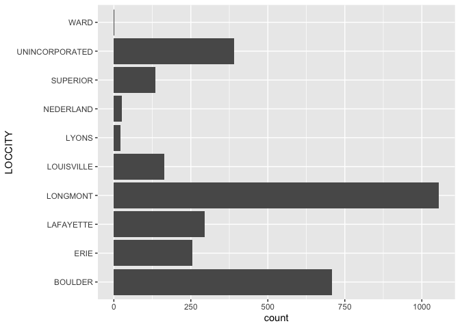

# Mini Data-Analysis: Deliverable 1
Jacob Sentlingar

Total points available: 74

# Part 0: Getting Set Up

Let’s get ready to work on this assignment!

**0.1: Install Packages**

- Install the [`diversedata`](https://diverse-data-hub.github.io/)
  package by typing the following into your **R console**:

<!-- -->

    install.packages("pak")
    library(pak)
    pak::pak("diverse-data-hub/diversedata")

**0.2: Load Packages**

Typically, R Packages are loaded in at the very beginning of the
analysis. If you later want to use other packages, please come back and
add them here:

``` r
library(tidyverse)
library(diversedata)
library(moderndive)
#--- Add any other packages below this line ---#
```

# Task 1: Choose a Data Set and Research Question

You may use one of the datasets from class or one of the datasets from
`diversedatahub`.

- **boulder-housing**: This data set contains housing information for
  the Boulder, Colorado area. *\[Add a second sentence here describing
  what the data covers — e.g., the variables included or what question
  it was collected to answer.\]*

- **squirrel-census**: Thes\[[great NYC squirrel
  census](https://www.thesquirrelcensus.com/),`squirrel-data.csv` –
  squirrel sightings recorded around Manhattan and Brooklyn parks.

- **rolling stone**: A [new visual
  essay](https://pudding.cool/2024/03/greatest-music/) from The Pudding
  compares Rolling Stone’s “500 Greatest Albums of All Time” lists from
  2003, 2012, and 2020. A methodology note says the project began with a
  spreadsheet by Chris Eckert and eventually led the authors to develop
  a dataset of their own. Theirs lists every album in the rankings — its
  name, genre, release year, 2003/2012/2020 rank, the artist’s name,
  birth year, gender, and more — plus each year’s voters. \[h/t Jason
  Kottke\]

- **coffee census**: In 2023, [British
  YouTuber](https://www.youtube.com/channel/UCMb0O2CdPBNi-QqPk5T3gsQ)
  (and former [World Barista
  Champion](https://www.jameshoffmann.co.uk/work#/coffee-competitions/))
  James Hoffman virtually hosted the [Great American Coffee Taste
  Test](https://www.youtube.com/watch?v=1fN_z4-EcOU), during which
  thousands of people simultaneously blind-tasted the same four coffees.
  Hoffman has published a [video summarizing the
  results](https://www.youtube.com/watch?v=bMOOQfeloH0), as well as [a
  spreadsheet of anonymized survey
  responses](https://bit.ly/gacttCSV+)from 4,000+ participants. It
  includes tasters’ demographics, general coffee drinking habits and
  preferences, assessments of the four coffees, and more. \[h/t Dan
  Brady\] (via
  [data-is-plural](https://www.data-is-plural.com/archive/2023-11-15-edition/))

- **wildfire**: This data set contains information on wildfires in
  Canada, compiled from official government sources under the Open
  Government Licence – Alberta. The data was gathered to monitor,
  assess, and respond to wildfire risks across different regions.
  Wildfires have far-reaching environmental, social, and economic
  consequences. From an equity and inclusion perspective, analyzing
  wildfire data can reveal geographic and resource-based disparities in
  detection and containment efforts, and highlight how certain
  populations face greater risks due to climate change and limited
  infrastructure. There are 26551 rows and 35 columns.

- **genderassessment**: Collected in 2023, the data allows for
  comparative evaluation across countries, sectors, and ownership types
  (e.g., Public, Private, Government). Each record represents a company
  and its corresponding evaluation across 28 detailed gender related
  indicators, offering a comprehensive snapshot of corporate gender
  equity worldwide. There are 2000 rows and 29 variables

- **hcmst**: This data set is adapted from the original data set [How
  Couples Meet and Stay Together 2017,
  2022](https://data.stanford.edu/hcmst2017). This study, led by
  researchers from Stanford University, surveyed 1,722 U.S. adults in
  2022 to explore how relationships form and change with time and
  focused on dating habits and the impact of the COVID-19 pandemic on
  relationships. This adapted data set focuses on variables that may
  affect the quality of the relationship, considering demographic
  characteristics of the subjects, couple dynamics, as well as
  COVID-19-related variables. The COVID-19 pandemic had a [significant
  impact](https://pmc.ncbi.nlm.nih.gov/articles/PMC10009005/) on
  romantic relationships in the United States. This data set enables
  exploration of how external factors, like the health of the subjects
  and changes in income, as well as personal behaviors, like conflict
  and intimate dynamics, relate to an individual’s perception of the
  quality of the relationship. There are 1328 rows and 21 columns.

- **womensmarchmadness**: This adapted data set contains historical
  records of every NCAA Division I Women’s Basketball Tournament
  appearance since the tournament began in 1982 up until 2018, capturing
  tournament results across more than four decades of collegiate women’s
  basketball. All data is sourced from the NCAA and contains the data
  behind the story [The Rise and Fall Of Women’s NCAA Tournament
  Dynasties](https://fivethirtyeight.com/features/louisiana-tech-was-the-uconn-of-the-80s/).
  The rise in popularity of the NCAA Women’s March Madness, fueled by
  athletes like Caitlin Clark and Paige Bueckers, reflects a broader
  cultural shift in the recognition of women’s sports. Beyond
  entertainment and athletic achievement, women’s participation in sport
  has social and professional benefits. There are 2092 rows and 20
  columns.

*Note: We encourage you to use one of the options above, but if you have
a data set that you’d really like to use, please check with a member of
the teaching team to see whether the data set is of appropriate
complexity. If approved, please add a brief description of the data
here.*

### 1.1: Choose 2 data sets **(2 points)**

Out of the 5 data sets listed above, choose **2** that appeal to you
based on their description. Write your choices below:

<!-------------------------- Start your work below ---------------------------->

1: Coffee Census

2: Boulder Housing

<!----------------------------------------------------------------------------->

### 1.2: Explore the Data **(12 points)**

One way to narrowing down your selection is to *explore* the data sets.
Use your knowledge of `dplyr` to summarize three variables in each of
the data sets (for example, listing what levels of a categorical
variable exist, or calculating the mean of a continuous variable of
interest). Write a sentence that describes your findings for each
variable explored. You may use multiple R code chunks if preferred.

<!-------------------------- Start your work below ---------------------------->

#### Data Set 1

``` r
### Explore 3 variables of data set 1 ###
coffee <- read_csv("dat/coffeeCensus.csv")
```

    Rows: 4042 Columns: 113
    ── Column specification ────────────────────────────────────────────────────────
    Delimiter: ","
    chr (44): Submission ID, What is your age?, How many cups of coffee do you t...
    dbl (13): Lastly, how would you rate your own coffee expertise?, Coffee A - ...
    lgl (56): Where do you typically drink coffee? (At home), Where do you typic...

    ℹ Use `spec()` to retrieve the full column specification for this data.
    ℹ Specify the column types or set `show_col_types = FALSE` to quiet this message.

``` r
coffee <- read_csv("dat/coffeeCensus.csv") |>
  rename(
    age       = `What is your age?`,
    fav_drink = `What is your favorite coffee drink?`,
    expertise = `Lastly, how would you rate your own coffee expertise?`,
    fav_coffee = `Lastly, what was your favorite overall coffee?`
  )
```

    Rows: 4042 Columns: 113
    ── Column specification ────────────────────────────────────────────────────────
    Delimiter: ","
    chr (44): Submission ID, What is your age?, How many cups of coffee do you t...
    dbl (13): Lastly, how would you rate your own coffee expertise?, Coffee A - ...
    lgl (56): Where do you typically drink coffee? (At home), Where do you typic...

    ℹ Use `spec()` to retrieve the full column specification for this data.
    ℹ Specify the column types or set `show_col_types = FALSE` to quiet this message.

``` r
age_levels <- c("<18 years old", "18-24 years old", "25-34 years old",
                "35-44 years old", "45-54 years old", "55-64 years old",
                ">65 years old")

coffee |>
  filter(!is.na(age), !is.na(fav_drink)) |>
  mutate(
    age = factor(age, levels = age_levels),
    fav_drink = fct_lump_n(fav_drink, 6)
  ) |>
  ggplot(aes(age, fill = fav_drink)) +
  geom_bar(position = "fill") +
  labs(x = NULL, y = "Share of respondents", fill = "Favorite drink") +
  coord_flip()
```



``` r
coffee |>
  filter(!is.na(expertise), !is.na(fav_coffee)) |>
  ggplot(aes(factor(expertise), fill = fav_coffee)) +
  geom_bar(position = "fill") +
  labs(x = "Self-rated expertise (1–10)", y = "Share of respondents",
       fill = "Favorite coffee")
```



``` r
profile <- tibble(
  coffee_name = c("A", "B", "C", "D"),
  Bitterness = c(
    mean(coffee$`Coffee A - Bitterness`, na.rm = TRUE),
    mean(coffee$`Coffee B - Bitterness`, na.rm = TRUE),
    mean(coffee$`Coffee C - Bitterness`, na.rm = TRUE),
    mean(coffee$`Coffee D - Bitterness`, na.rm = TRUE)
  ),
  Acidity = c(
    mean(coffee$`Coffee A - Acidity`, na.rm = TRUE),
    mean(coffee$`Coffee B - Acidity`, na.rm = TRUE),
    mean(coffee$`Coffee C - Acidity`, na.rm = TRUE),
    mean(coffee$`Coffee D - Acidity`, na.rm = TRUE)
  )
)

ggplot(profile, aes(Bitterness, Acidity, label = coffee_name)) +
  geom_point(size = 4) +
  geom_text(vjust = -1) +
  labs(x = "Mean bitterness (1–5)", y = "Mean acidity (1–5)")
```



From the first stacked bar chart, I can see that as age increases people
start to prefer lattes less and start to prefer regular drip coffee
more. From the second stacked bar chart I can see that as expertise
increases Coffee D seems to be picked more often, Coffee C and Coffee B
decrease as expertise increases. Finally the last scatter plot shows the
general flavor profiles of the coffees, Coffee A and D are both very
acidic but not very bitter. Coffee B and C on the other hand are very
bitter and not very acidic.

#### Data Set 2

``` r
### Explore 3 variables of data set 2 ###
boulder <- read_csv("dat/boulder-2020-residential_sales.csv")
```

    Rows: 3052 Columns: 37
    ── Column specification ────────────────────────────────────────────────────────
    Delimiter: ","
    chr (24): Account #, PARCELNB, PROPERTY_ADDRESS, LOCCITY, SUBNAME, MULTIPLE_...
    dbl (13): Market
    Area 1, BLDG1_YEAR_BUILT, BEDROOMS, FULL_BATHS, THREE_QTR_B...

    ℹ Use `spec()` to retrieve the full column specification for this data.
    ℹ Specify the column types or set `show_col_types = FALSE` to quiet this message.

``` r
boulder <- boulder |>
  mutate(SALE_PRICE = parse_number(SALE_PRICE))

boulder |>
  ggplot(aes(x = SALE_PRICE, y = LOCCITY)) +
  geom_boxplot()
```



``` r
boulder |>
  filter(ABOVE_GROUND_SQFT > 0) |>
  ggplot(aes(x = ABOVE_GROUND_SQFT, y = SALE_PRICE, color = ACCOUNT_TYPE)) +
  geom_point(alpha = 0.5)
```



``` r
boulder |>
  ggplot(aes(x = LOCCITY)) +
  geom_bar() +
  coord_flip()
```



The first boxplot shows the sales price for each individual city, house
sales in the city Boulder are much higher than other cities. The city of
Boulder has the highest outliers as well. On the other side the city of
Ward has the lowest sale prices. The second graph, the scatter plot,
explores sales price compared to square feet. It also seperates it by
normal houses and condos. The general trend is that there is a positive
linear trend, with some very high outliers. The third graph, the bar
chart, is counting the amount of sales in each city. Longmont has the
most sales by far, and Ward has the least amount of sales.

<!----------------------------------------------------------------------------->

### 1.3: Choose 1 Data Set **(2 points)**

It’s time to choose only one data set. State the data set that you’ve
chosen, and why you’ve chosen it.

<!-------------------------- Start your work below ---------------------------->

Out of the two datasets I am going to choose the Coffee Census data to
work with. It has a lot more to explore and is a much larger dataset. I
also want to know more about Coffee because I like Coffee.

<!----------------------------------------------------------------------------->

### 1.4: Research Question **(4 points)**

Let’s choose a primary and a secondary research question to explore.

Write your research questions **as questions**, and be specific. You can
change it later if needed.

> For example, if I had chosen a `titanic` data set for my project, I
> might ask, “(Primary) Is there a relationship between survival and the
> class of the passengers? (Secondary) Does this relationship differ by
> gender?”

<!-------------------------- Start your work below ---------------------------->

Is there a relationship between self-reported expertise and money spent
of equipment? Does this relationship differ by home brew method?

<!----------------------------------------------------------------------------->

### 1.5: Commit **(2 points)**

Commit your work and push it to GitHub. Include an informative commit
message, and include “(1.5)” in the message.

# Task 2: Further Exploring Your Chosen Data Set

### 2.1: Missing Data **(6 points)**

Missing data is inevitable, and can complicate analyses. Let’s see what
variables (if any) have missing data in your chosen data set.

Your task is to create a table that calculates the proportion of missing
values per variable. Be sure to output the table.

<!-------------------------- Start your work below ---------------------------->

``` r
### Explore missingness here ###
coffee |>
  summarise(across(everything(), ~ mean(is.na(.x)))) |>
  pivot_longer(cols = everything(),
  names_to = "variable_name",
  values_to = "missing_prop") |>
    arrange(desc(missing_prop)) |>
    print(n = Inf)
```

    # A tibble: 113 × 2
        variable_name                                                   missing_prop
        <chr>                                                                  <dbl>
      1 What kind of flavorings do you add?                                  1      
      2 What kind of flavorings do you add? (Vanilla Syrup)                  1      
      3 What kind of flavorings do you add? (Caramel Syrup)                  1      
      4 What kind of flavorings do you add? (Hazelnut Syrup)                 1      
      5 What kind of flavorings do you add? (Cinnamon (Ground or Stick…      1      
      6 What kind of flavorings do you add? (Peppermint Syrup)               1      
      7 What kind of flavorings do you add? (Other)                          1      
      8 What other flavoring do you use?                                     1      
      9 Gender (please specify)                                              0.997  
     10 Where else do you purchase coffee?                                   0.992  
     11 What else do you add to your coffee?                                 0.988  
     12 Ethnicity/Race (please specify)                                      0.974  
     13 Please specify what your favorite coffee drink is                    0.971  
     14 Other reason for drinking coffee                                     0.959  
     15 What kind of sugar or sweetener do you add?                          0.873  
     16 What kind of sugar or sweetener do you add? (Granulated Sugar)       0.872  
     17 What kind of sugar or sweetener do you add? (Artificial Sweete…      0.872  
     18 What kind of sugar or sweetener do you add? (Honey)                  0.872  
     19 What kind of sugar or sweetener do you add? (Maple Syrup)            0.872  
     20 What kind of sugar or sweetener do you add? (Stevia)                 0.872  
     21 What kind of sugar or sweetener do you add? (Agave Nectar)           0.872  
     22 What kind of sugar or sweetener do you add? (Brown Sugar)            0.872  
     23 What kind of sugar or sweetener do you add? (Raw Sugar (Turbin…      0.872  
     24 How else do you brew coffee at home?                                 0.832  
     25 On the go, where do you typically purchase coffee?                   0.824  
     26 On the go, where do you typically purchase coffee? (National c…      0.821  
     27 On the go, where do you typically purchase coffee? (Local cafe)      0.821  
     28 On the go, where do you typically purchase coffee? (Drive-thru)      0.821  
     29 On the go, where do you typically purchase coffee? (Specialty …      0.821  
     30 On the go, where do you typically purchase coffee? (Deli or su…      0.821  
     31 On the go, where do you typically purchase coffee? (Other)           0.821  
     32 What kind of dairy do you add?                                       0.583  
     33 What kind of dairy do you add? (Whole milk)                          0.580  
     34 What kind of dairy do you add? (Skim milk)                           0.580  
     35 What kind of dairy do you add? (Half and half)                       0.580  
     36 What kind of dairy do you add? (Coffee creamer)                      0.580  
     37 What kind of dairy do you add? (Flavored coffee creamer)             0.580  
     38 What kind of dairy do you add? (Oat milk)                            0.580  
     39 What kind of dairy do you add? (Almond milk)                         0.580  
     40 What kind of dairy do you add? (Soy milk)                            0.580  
     41 What kind of dairy do you add? (Other)                               0.580  
     42 Coffee C - Notes                                                     0.410  
     43 Coffee B - Notes                                                     0.392  
     44 Coffee A - Notes                                                     0.362  
     45 Coffee D - Notes                                                     0.360  
     46 Political Affiliation                                                0.186  
     47 Number of Children                                                   0.157  
     48 Ethnicity/Race                                                       0.154  
     49 Employment Status                                                    0.154  
     50 Education Level                                                      0.149  
     51 Do you feel like you’re getting good value for your money with…      0.136  
     52 Do you feel like you’re getting good value for your money when…      0.134  
     53 Approximately how much have you spent on coffee equipment in t…      0.133  
     54 What is the most you'd ever be willing to pay for a cup of cof…      0.132  
     55 In total, much money do you typically spend on coffee in a mon…      0.131  
     56 Gender                                                               0.128  
     57 Do you work from home or in person?                                  0.128  
     58 What is the most you've ever paid for a cup of coffee?               0.127  
     59 Do you know where your coffee comes from?                            0.119  
     60 Do you like the taste of coffee?                                     0.119  
     61 Why do you drink coffee?                                             0.117  
     62 Why do you drink coffee? (It tastes good)                            0.117  
     63 Why do you drink coffee? (I need the caffeine)                       0.117  
     64 Why do you drink coffee? (I need the ritual)                         0.117  
     65 Why do you drink coffee? (It makes me go to the bathroom)            0.117  
     66 Why do you drink coffee? (Other)                                     0.117  
     67 How do you brew coffee at home?                                      0.0952 
     68 How do you brew coffee at home? (Pour over)                          0.0943 
     69 How do you brew coffee at home? (French press)                       0.0943 
     70 How do you brew coffee at home? (Espresso)                           0.0943 
     71 How do you brew coffee at home? (Coffee brewing machine (e.g. …      0.0943 
     72 How do you brew coffee at home? (Pod/capsule machine (e.g. Keu…      0.0943 
     73 How do you brew coffee at home? (Instant coffee)                     0.0943 
     74 How do you brew coffee at home? (Bean-to-cup machine)                0.0943 
     75 How do you brew coffee at home? (Cold brew)                          0.0943 
     76 How do you brew coffee at home? (Coffee extract (e.g. Cometeer…      0.0943 
     77 How do you brew coffee at home? (Other)                              0.0943 
     78 Coffee C - Acidity                                                   0.0720 
     79 Between Coffee A and Coffee D, which did you prefer?                 0.0695 
     80 Coffee C - Bitterness                                                0.0688 
     81 Coffee D - Personal Preference                                       0.0688 
     82 Coffee D - Acidity                                                   0.0685 
     83 Coffee C - Personal Preference                                       0.0683 
     84 Coffee B - Acidity                                                   0.0680 
     85 Coffee D - Bitterness                                                0.0680 
     86 fav_coffee                                                           0.0673 
     87 Between Coffee A, Coffee B, and Coffee C which did you prefer?       0.0668 
     88 Coffee B - Personal Preference                                       0.0666 
     89 Coffee A - Acidity                                                   0.0651 
     90 Coffee B - Bitterness                                                0.0648 
     91 Coffee A - Personal Preference                                       0.0626 
     92 Coffee A - Bitterness                                                0.0604 
     93 How strong do you like your coffee?                                  0.0312 
     94 How much caffeine do you like in your coffee?                        0.0309 
     95 expertise                                                            0.0257 
     96 What roast level of coffee do you prefer?                            0.0252 
     97 How many cups of coffee do you typically drink per day?              0.0230 
     98 Before today's tasting, which of the following best described …      0.0208 
     99 Do you usually add anything to your coffee?                          0.0205 
    100 Do you usually add anything to your coffee? (No - just black)        0.0203 
    101 Do you usually add anything to your coffee? (Milk, dairy alter…      0.0203 
    102 Do you usually add anything to your coffee? (Sugar or sweetene…      0.0203 
    103 Do you usually add anything to your coffee? (Flavor syrup)           0.0203 
    104 Do you usually add anything to your coffee? (Other)                  0.0203 
    105 Where do you typically drink coffee?                                 0.0173 
    106 Where do you typically drink coffee? (At home)                       0.0166 
    107 Where do you typically drink coffee? (At the office)                 0.0166 
    108 Where do you typically drink coffee? (On the go)                     0.0166 
    109 Where do you typically drink coffee? (At a cafe)                     0.0166 
    110 Where do you typically drink coffee? (None of these)                 0.0166 
    111 fav_drink                                                            0.0153 
    112 age                                                                  0.00767
    113 Submission ID                                                        0      

<!----------------------------------------------------------------------------->

### 2.2: Missing Data (Again) **(6 points)**

Based on your research question, will this missingness pose an issue?
For the purposes of this class (and this class only!), we will consider
missingness a problem **if there is more than 20% of a single variable
(that is of interest) is missing**.

> For example, let’s assume I wanted to explore the following research
> questions: “Is there a relationship between survival and the class of
> the passengers? Does this relationship vary by gender?”. If the
> variable indicating whether or not a person survived was missing for
> 20% or more of the passengers, then this would be a problem. However,
> if a variable indicating the colour of shirt a passenger was wearing
> was missing, this probably wouldn’t be an issue as that variable is
> quite irrelevant to my analysis!

Based on this definition, is missingness an issue for your analysis? If
so, describe how you will address this (pivoting your research question,
for example). If you will continue with a new research question, write
it here! **Do not go back to Task 1 and redo the analysis.** ).

If missingness is not an issue, describe why.

<!-------------------------- Start your work below ---------------------------->

Missingness is not an issue, the variables I need all have below 20% of
the data missing. “Self-rated coffee expertise” has 2.6% of the data
missing, “Money spent on equipment in the past 5 years” has 13.3% of the
data missing, and “How do you brew coffee at home?” has 9.5% of the data
missing. So all of my variables that I need have enough data to work
with.

<!----------------------------------------------------------------------------->

### 2.3: Tidy your Data **(10 points)**

Produce a tidy data set that could be used to answer your research
questions. **Please ensure you have at least one quantitative (numeric)
and one categorical variable in your data set. It’s okay you need to
include a less relevant variable in your tidied data to ensure this.**

To tidy your data, you should:

- Create new variables (if needed)

- Transform the data into a tidy form (if needed)

- Remove irrelevant columns (if needed)

- Comment your code throughout

Show the first 6 rows of the tidied data.

<!-------------------------- Start your work below ---------------------------->

``` r
tidy_coffee <- coffee |>

  #Selecting the rows needed while also renaming them
  select(
    id = `Submission ID`,
    expertise,
    spent = `Approximately how much have you spent on coffee equipment in the past 5 years?`,
    starts_with("How do you brew coffee at home? (")
  ) |>

  #The current data is in wide format, need to pivot longer to have brew method as a single variable not multiple columns
  pivot_longer(
    cols = starts_with("How do you brew coffee at home?"),
    names_to = "brew_method",
    names_prefix = "How do you brew coffee at home\\? ",
    values_to = "uses"
  ) |>

  #Filter for things where uses = TRUE to remove people who did not state their brew_method
  filter(uses) |>

  #Now remove the uses column for cleaner data
  select(-uses) |>

  #This line was assisted by claude because I did not know how to format the regex
  mutate(brew_method = str_remove_all(brew_method, "^\\(|\\)$"))

head(tidy_coffee)
```

    # A tibble: 6 × 4
      id     expertise spent brew_method                                
      <chr>      <dbl> <chr> <chr>                                      
    1 BkPN0e        NA <NA>  Pod/capsule machine (e.g. Keurig/Nespresso)
    2 W5G8jj        NA <NA>  Bean-to-cup machine                        
    3 4xWgGr        NA <NA>  Coffee brewing machine (e.g. Mr. Coffee)   
    4 QD27Q8        NA <NA>  Pour over                                  
    5 V0LPeM        NA <NA>  French press                               
    6 V0LPeM        NA <NA>  Espresso                                   

<!----------------------------------------------------------------------------->

### 2.4: Create a Table (10 points)

Use any functions from the `tidyverse` to create one table that outputs
the mean, minimum, and maximum of all numeric columns in your data,
dropping the missing values if they exist.

Show the outputted table.

<!-------------------------- Start your work below ---------------------------->

``` r
#Small disclaimer: This summarise function is double counting people for the mean, this is because the tidy dataset has multiple rows for the same person if they selected multiple answers for "brew_method"
tidy_coffee |>
  summarise(
    mean = mean(expertise, na.rm = TRUE),
    min = min(expertise, na.rm = TRUE),
    max = max(expertise, na.rm = TRUE)
    )
```

    # A tibble: 1 × 3
       mean   min   max
      <dbl> <dbl> <dbl>
    1  6.04     1    10

<!----------------------------------------------------------------------------->

### 2.5: Commit **(2 points)**

Commit your work and push it to GitHub. , and include “(2.7)” in the
message.

# Task 3: Tidy Your Submission Overall

Check over your document and GitHub repository for the following:

### 3.1: Coherence **(2 points)**

The document should read sensibly from top to bottom, with no major
continuity errors. An example of a major continuity error is having a
data set listed for Task 3 that is not part of one of the data sets
listed in Task 1.

### 3.2: Error-free code **(2 points)**

For full marks, all code in the document should run without error and be
completely reproducible.

### 3.3 README **(6 points)**

There should be a file named `README.md` at the top level of your
repository. Its contents should automatically appear when you visit the
repository on GitHub.

Minimum contents of the README file:

- In a sentence or two, explains what this repository is, so that
  future-you or someone else stumbling on your repository can be
  oriented to the repository.
- List the files/folders contained in the repository
- In a sentence or two, briefly explains how to engage with the
  repository. You can assume the person reading knows the material from
  STAT 545A. Basically, if a visitor to your repository wants to explore
  your project, what should they know? How can they reproduce your
  report?

### 3.4 Generative AI Disclosure **(3 points)**

In this course, Generative AI can be used in the following ways:

- to clarify concepts discussed in class

- as an “advanced search engine” (i.e., searching error codes)

- debugging code that students wrote and attempted to debug on their own

Generative AI **CANNOT** be used to generate text or code (including
comments) from scratch.

Any use of Generative AI must be disclosed.

**To disclose your use, please copy and paste the following template
into the README of your GitHub Repository and fill out the relevant
details** \[in square brackets\]. BE SPECIFIC. Saying you used it to
debug your code is not enough. Explicitly describe where you got stuck

Here is an example of a specific, explicit debug:

> “I had the error `attempt to apply non-function` after running my
> code. I used Claude to help me identify that this error was due to me
> attempting to multiply two numbers together without the use of a `*`,
> i.e. `(2)(3)` instead of `2*3`.”

``` markdown

## Generative AI Statement

Generative AI (through [LIST MODELS USED, i.e. ChatGPT, CoPilot)] was used to
help me complete  this assignment in the following ways.

1. Claude was used to help me debug when I had syntax errors, such as finding when I put a space instead of an underscore for a variable, it also helped me with this line: mutate(brew_method = str_remove_all(brew_method, "^\\(|\\)$")), because I did not know how to format the regex.

2. [Describe here]

...

I affirm that Generative AI was not used to generate text, code, or comments for
my assessments.
```

If you did not use Generative AI, please include the following in your
README:

``` markdown

## Generative AI Statement

Generative AI was not used in any way throughout this assignment.
```

Assessments suspected of having AI-generated text and/or code, or
assignments where the Generative AI use was not disclosed, will be
flagged and temporarily assigned a grade of zero. Students will be
required to meet with the instructor to receive a grade.

### 3.5 Output **(4 points)**

All output on GitHub is readable, recent and relevant:

- All `.qmd` files have been rendered to their output `.md` files.
- All rendered `.md` files are viewable without errors on Github.
  Examples of errors: Missing plots, “Sorry about that, but we can’t
  show files that are this big right now” messages, error messages from
  broken R code
- All of these output files are up-to-date – that is, they haven’t
  fallen behind after the source (`.qmd`) files have been updated.
- There should be no relic output files. For example, if you were
  rendering a `.qmd` to `.html`, but then changed the output to be only
  a markdown file, then the `.html` file is a relic and should be
  deleted.

# Step 4: Submission

\*\* Submit repo link \*\*

To submit this milestone, submit the github link to the repo.

This assignment was authored by the team of instructors at University of
British Colombia’s STA 545 class.
